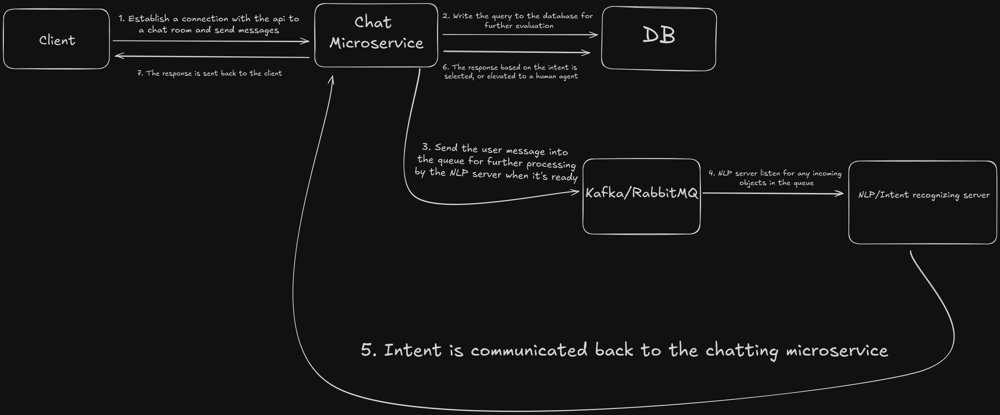

# Trood Task

A video explaining my thought process: https://youtu.be/tsPO4FxZ8Ek Not mandatory to watch as everything is described in the readme, thought it might benefit me :)

## Architecture Proposal

The [diagram](https://excalidraw.com/#json=FP3AG37PEHdWTG06--DFO,g8H9wgnPifmnmNJuDV0_5Q) depicting the architecture


### Basic Structure: 
- Web Server (Golang/Node/Kotlin) - Just the main API entry point  
- Intent recognition Server (Most models are made for Python, so probably python) - Should be listening for Kafka/RabbitMQ events that are going to be just the user queries to be processed for user intent. 
  -  The NLP model needs to map user messages to predefined intents (spaCy, Hugging Face Transformers, BERT)
- Database (PostgresQL) - Will be used as a knowledge base for responding to users and their intents. Might need more context, but a vector database sounds like overkill, a simple intent keyword -> answer should suffice. This will also be storing the user chat to evaluate responses and evaluate human agents when they come in play.
- Queue (RabbitMQ, Kafka) - Choosing the backend for a queueing system depends on the requirements. If the priority queue is just a simple FIFO - then kafka, if perhaps the wish is to evaluate user sentiment (angrier customer likely need to be addressed first, and happier ones may not be expecting a response at all), then RabbitMQ is a better fit.

-----
## Startup

Requirements:
- Docker Compose

### Steps

```
docker compose -f compose.yml up
```

The main API should be running on port 1323.

To test out the functionality of the proposed solution: there are 2 endpoints 

```
POST http://localhost:1323/support/:conversationId/query

Body json:
{
  "query": string;
}

- Creates the conversation with id `conversationId` and send the user query to the nlp server for a response
```

```
GET http://localhost:1323/support/:conversationId

- Fetches the messages in room id `conversationId` allowing to see the messages in the room
```

